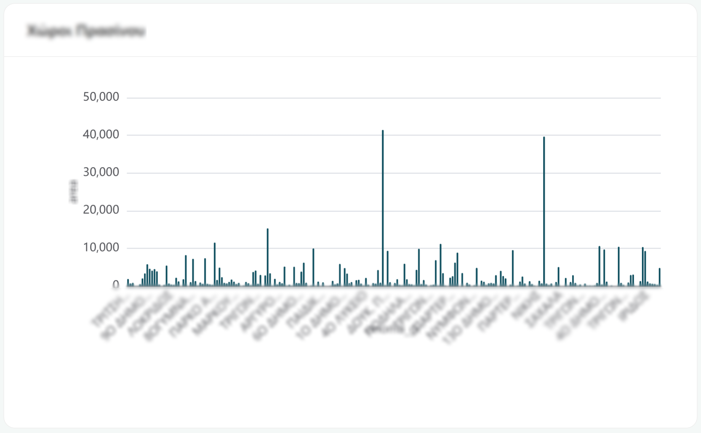
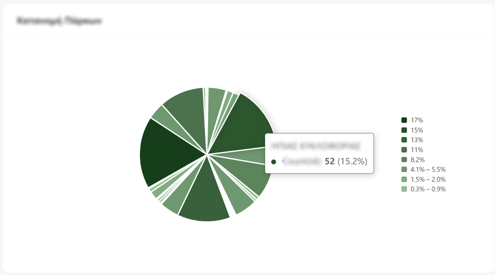
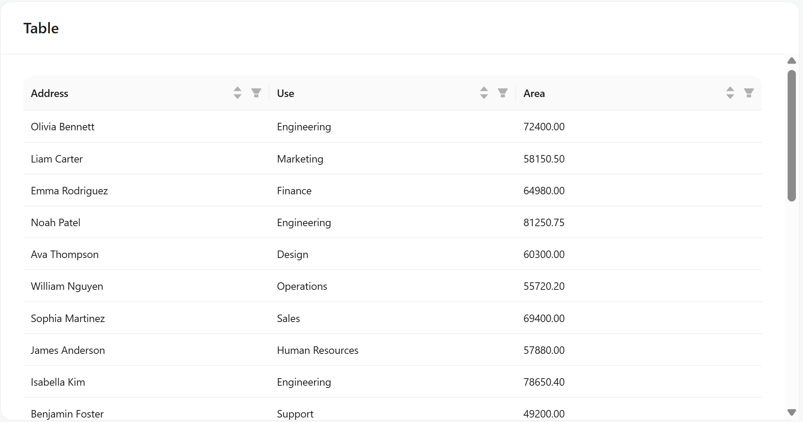
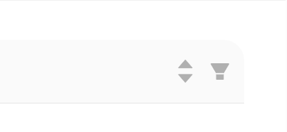
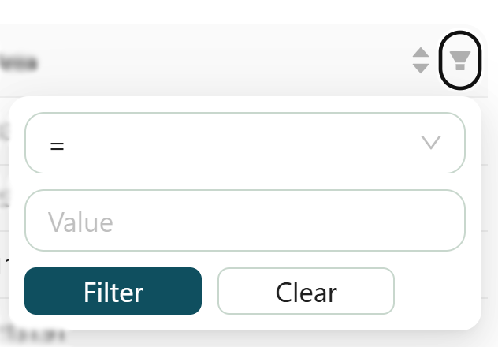
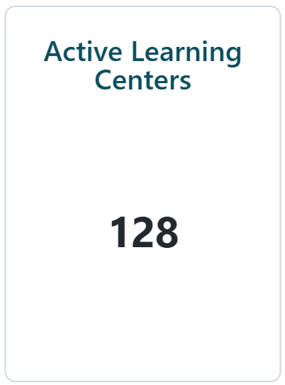
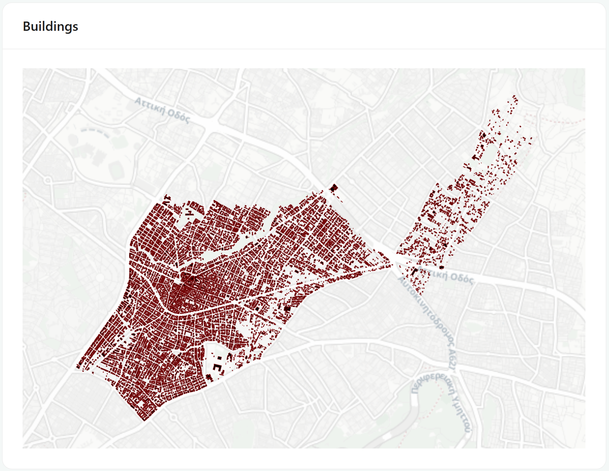
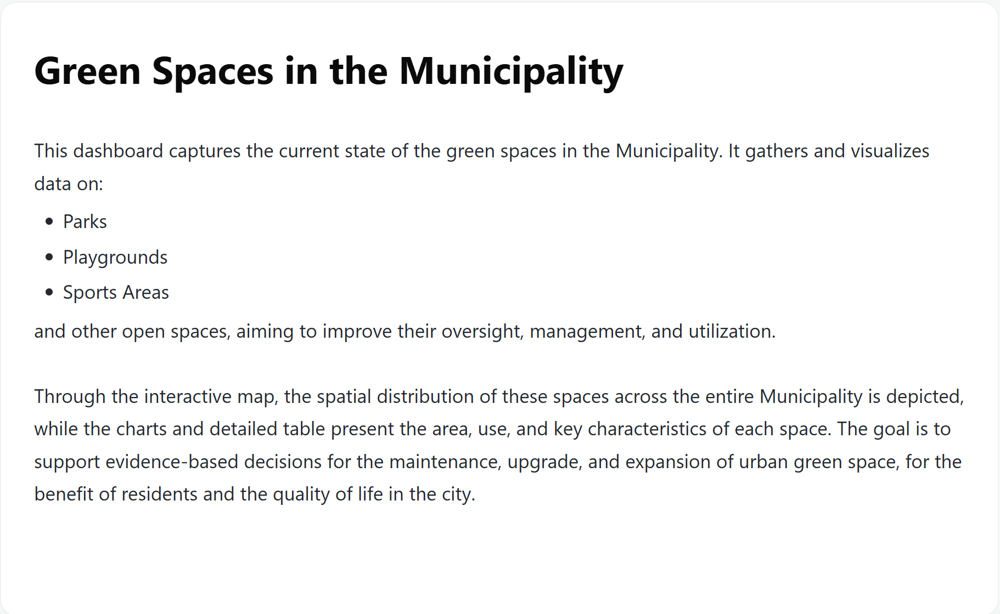

# Chart Types

There are six kinds of charts:

## Bar chart

Compares one thing across categories (population by district, cases by type, spend by department, etc).
Hover over any bar to see its exact value in a tooltip.

## Pie chart

Shows how a whole splits into parts (what share of the total each category takes). Hover over a slice and you'll get the category name, its actual value, and its percentage of the total. The list beside the chart is the legend.

## Table

The actual records, one per row. This is where you go when the summary isn't enough and you need the detail.

It's more interactive than it looks:

**`Sort`**: click a column heading. Click again to reverse it.

**`Filter`**: click the little filter icon in a column heading. A small form opens, and it adapts to the kind of column. **Number** columns let you set conditions like greater than, less than, equals, or between two values and **Text** columns let you match on equals, contains, starts with, or ends with.

{width="300"}
{width="300"}

## Counter

A single block showing information about a category. Count, Average, Maximum, Minimum etc.

{width="200"}

## Map

A map of one data layer, already zoomed to the area the author wanted you to see.

When you click, a small **Feature Info box** opens with an ✕ to close it, which shows information about the clicked feature's details.

{width="300"}

## Text

A formatted note from the dashboard's author - an explanation, a caveat, a definition of terms, or instructions. Worth reading before you interpret the numbers, since this is usually where the "what this actually measures" detail lives.

