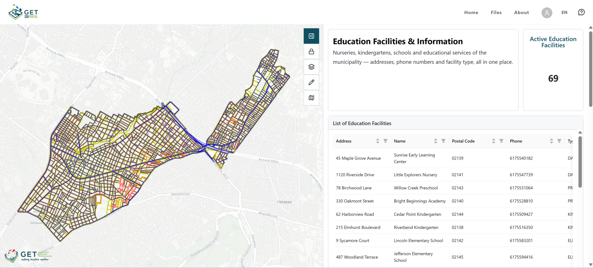
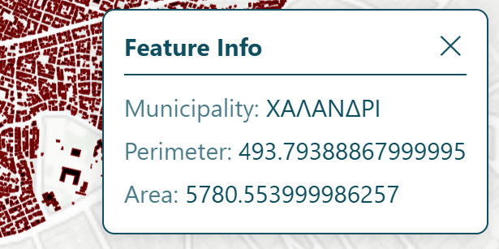
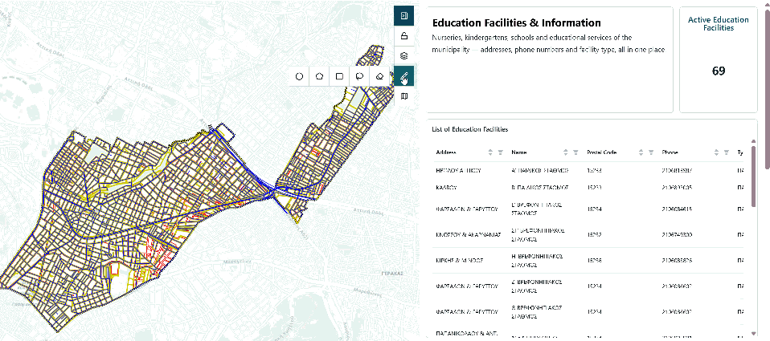
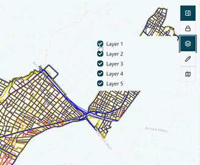
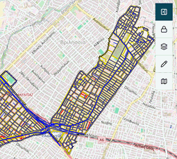

# The Map Dashboard

## What makes it different

On a **map dashboard**, the map isn't just another card, the charts in the side panel are wired to it. 

Draw a **shape** on the map, and every chart, number and table instantly recalculates using the records inside that shape.

That's the whole idea: instead of reading fixed totals, you get to ask *"what about this area?"* and see the answer immediately.

## Moving around the map

**Drag to pan**. Double-click or pinch to zoom. By default the scroll wheel won't zoom the map, to enable it click the padlock button in the toolbar to unlock it.

**Click anywhere on the map** to ask what's there. A Feature Info popup opens listing the details of whatever you clicked.

{width="300"}

## The toolbar buttons

| Button | What it does |
| :---: | --- |
|  | **Collapse Panel**: Hides the chart panel so the map gets the full screen - or brings it back |
|  | **Scroll Lock**: Turns mouse-wheel zoom on or off. Closed - off (the default) | 
|  | **Layers Overview**: A tick-list of the map's data layers. Untick to hide one, tick to bring it back | 
|  | **Draw**: Opens the drawing tools - this is the area-filter feature | 
|  | **Basemap Switch**: Switches the background map | 

## The Drawing Tool

Click Draw and you get four ways to mark an area:

| Tool | How to use it |
| --- | --- |
| **Circle** | Click for the centre, drag out, click again to finish |
| **Polygon** |	Click each corner, double-click the last one to close it |
| **Square** | Click and drag from one corner to the opposite one |
| **Lasso** | Hold the mouse down and draw freehand |
| **Eraser** | Removes the shape and puts every chart back to its full totals |

### What happens the moment you finish drawing

By default the side panel, shows data based on the whole map.

After you select an area with a shape, every chart in the side panel reloads: the numbers, the bar and pie charts, and the table all recalculate against the records your shape touches. You'll see a brief loading state on each card while this happens.

After drawing a shape, you can move its position by dragging it with the mouse cursor.

If you want to remove the shape drawn, use the **Eraser** to clear the shape from the map, this action will reset the data in charts to the default state.

## The Layers Tool

The layers tool allows you to enable and disable which layers to be visible on the map.

!!! note "Enabling/Disabling Layers"

    This option doesn't change the way data are calculated or shown. Enabling/Disabling layers is only a visual option separate of the shape drawing and calculation methods.

## Basemap Change Tool

The basemap button changes the visual of the map to a choice of many available basemaps.

