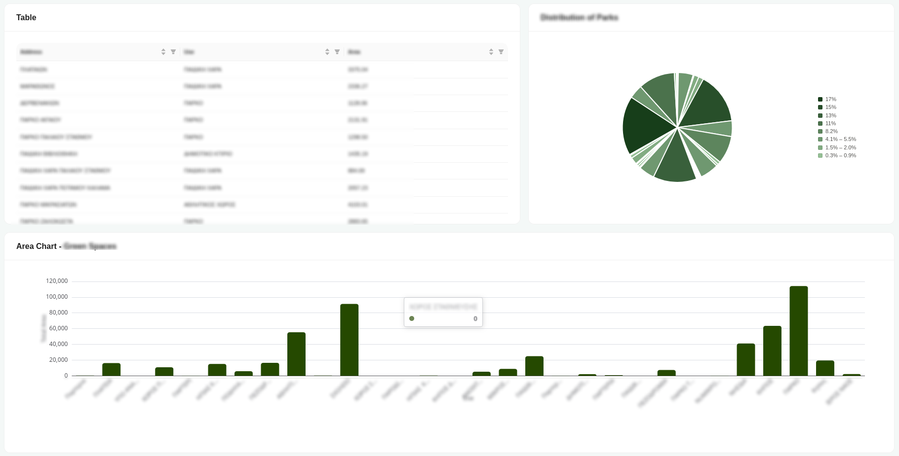

# The Standard Dashboard

The **standard dashboard** presents your data through a collection of coordinated visual components, letting you take in an overview at a glance while drilling into specifics as needed:

* A sortable, filterable **table** lays out individual records row by row, so you can inspect exact values and narrow the view down to just what you're interested in.
* A **pie chart** breaks down how the total is distributed across categories, making proportions and relative shares easy to read.
* A **bar chart** compares magnitudes across groups so larger and smaller segments stand out immediately.
* A **map component** plots records geographically, giving spatial context to the underlying data.
* A **counter block** surfaces key aggregate figures at a glance, displaying the count, minimum, maximum, average, and sum of the selected data.

Together these pieces turn raw records into an interactive picture you can scan quickly or interrogate in detail.

