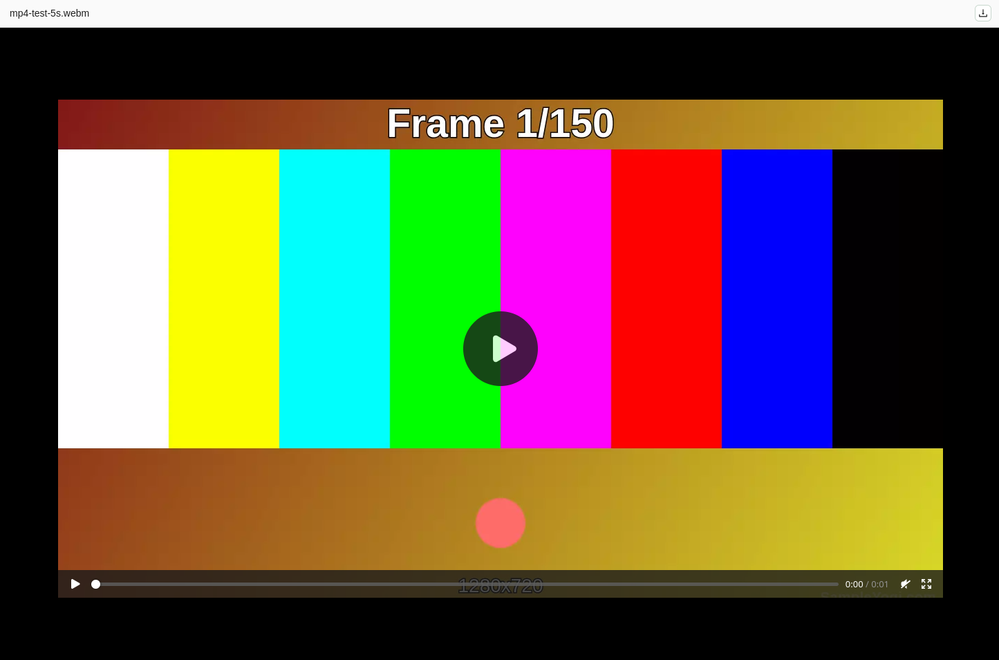

# File types

Not all files can be displayed inline in the preview pane. The table below lists which
file types support a preview, and what kind of preview is shown for each.

| Icon | Supported extensions | Preview type | Preview |
| :---: | :--- | :--- | :---: |
|  | `pdf` | PDF | {width="120"} |
|  | `jpg`, `jpeg`, `png`, `gif`, `svg`, `webp`, `bmp` | Image | {width="120"} |
|  | `mp4`, `webm`, `ogv` | Video | {width="120"} |
|  | `mp3`, `wav`, `ogg`, `flac` | Audio | {width="120"} |
|  | `xls`, `xlsx`, `csv` | None - download only | {width="120"} |
|  | `doc`, `docx`, `txt` | None - download only | {width="120"} |
|  | All other extensions | None - download only | {width="120"} |

