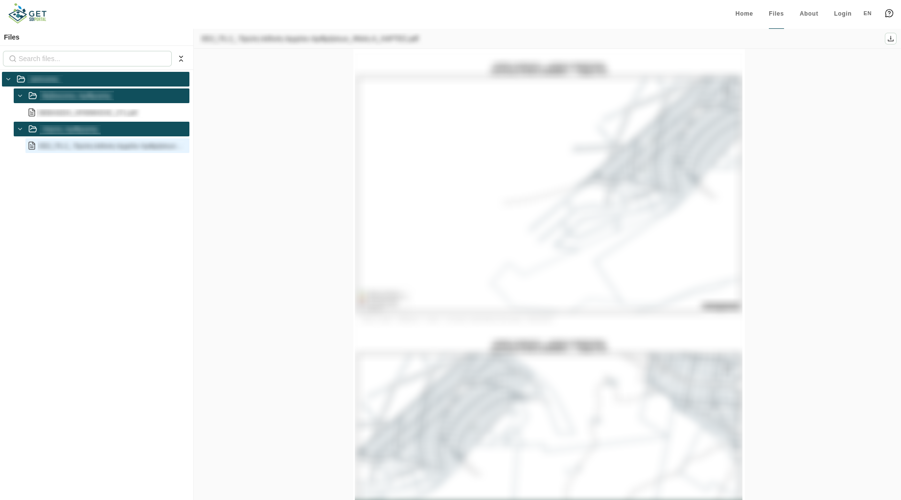
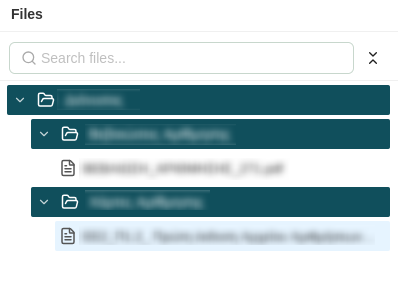
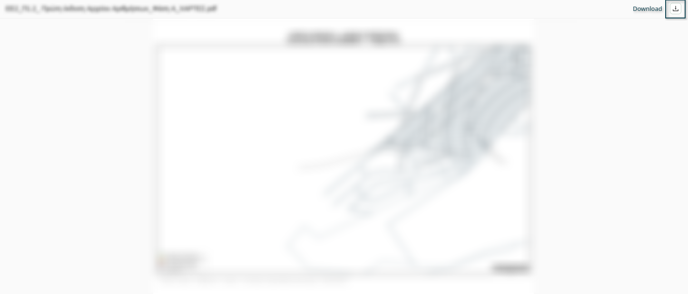
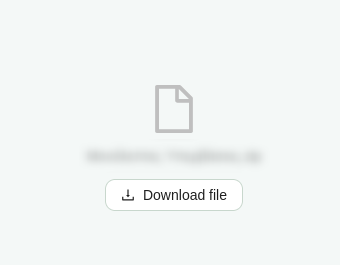

# Files

The **Files** page provides a document and media library, giving you access to files that
the organization has published alongside its maps and dashboards - reports, guidelines,
datasets, or any other supporting material.

## File Tree

On the left, a sidebar shows the file tree, organized into **filenodes**
(directories, which can contain further sub-filenodes) and the **files** inside them.

* **Search:** filter the tree down to matching filenodes and files by name.
* **Expand / collapse all:** open or close every filenode in the tree at once.
* **Browse:** click a filenode to expand it and reveal its contents; click a file to open it in the preview.

## File Preview

Selecting a file opens it in the preview pane, alongside a small header showing the full
file name and a button for downloading it.

Not every file type can be shown inline - if no preview is available, the pane just
displays the download button instead.

For the full list of supported file types and their preview behavior, see [File Types](file-types.md).
