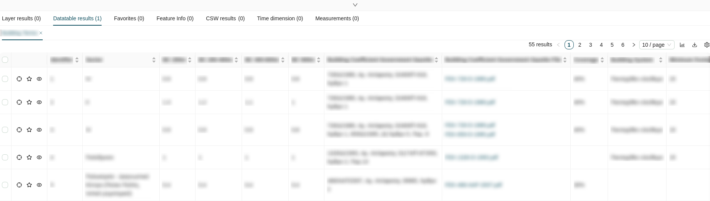
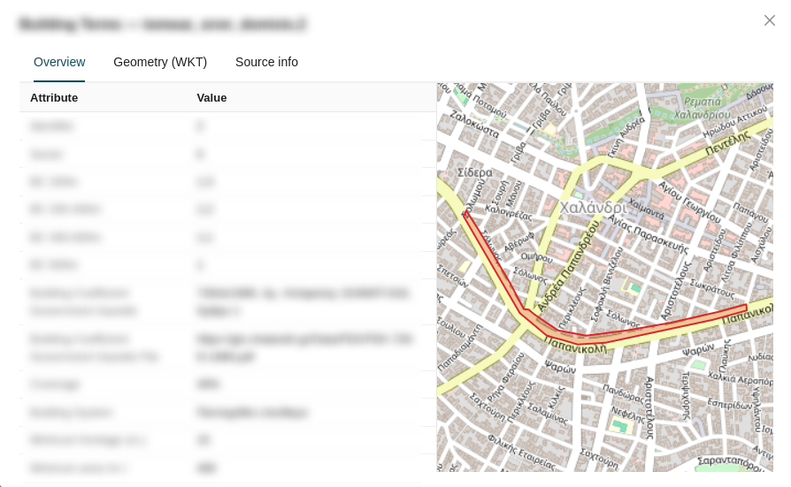
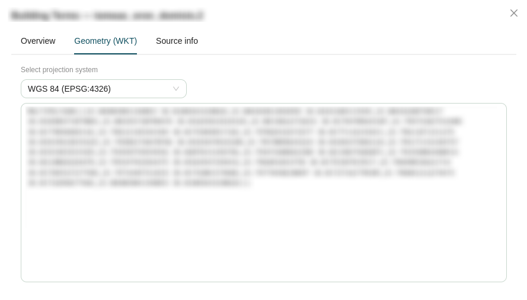
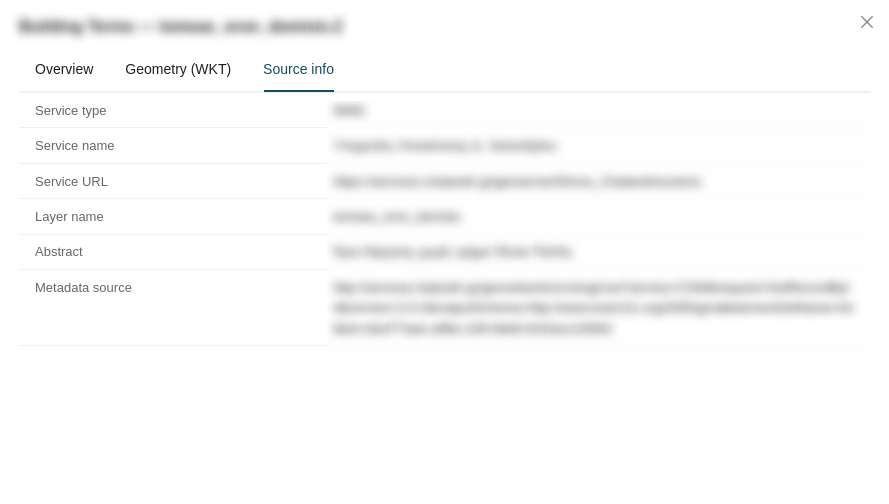
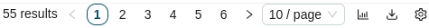

# Attribute Table

The **Attribute Table** is a resizable, draggable bottom panel that serves as the central hub for viewing and interacting with tabular feature data across the Map Viewer. It is organized into multiple tabs, each corresponding to a different data source or workflow.

## Table Format

All tabs within the Attribute Table share a consistent table layout:

### Columns

* **Checkbox Column:** The first column provides a selectable checkbox for each row, allowing you to select one or multiple features simultaneously. Each row represents a feature from the corresponding map layer.
* **Actions Column:** The second column contains three action buttons per row:

    | Icon | Action | Description |
    | :---: | :--- | :--- |
    |  | **Zoom to extent** | Zooms and pans the map canvas to the geographic location of the feature. |
    |  | **Add to favorites** | Adds the feature to the [Favorites](#favorites) tab for quick reference. |
    |  | **View details** | Opens a modal window displaying the full feature details. |

* **Attribute Columns:** The remaining columns display the feature's attribute fields. All attribute columns are sortable by clicking their header.

### View Details Modal

The **View details** modal provides an in-depth inspection of a single feature, organized into three tabs:

* **Overview:** Displays a focused map view centered on the feature alongside a table listing all associated attribute data.
* **Geometry (WKT):** Shows the feature's geometry in Well-Known Text format. A projection dropdown allows you to convert the geometry representation between supported coordinate systems:

    | Projection | EPSG Code |
    | :--- | :--- |
    | **WGS 84** | `EPSG:4326` |
    | **Web Mercator** | `EPSG:3857` |
    | **ΕΓΣΑ 87** | `EPSG:2100` |

* **Source info:** Displays metadata about the feature's originating data source.

### Pagination and Controls

The top-right corner of the table provides controls for managing result display and export:

* **Results Count:** Displays the total number of matching features.
* **Page Navigation:** Shows the current page and total number of pages, with controls to navigate between them.
* **Results Per Page:** A dropdown to adjust how many rows are displayed per page (`10`, `20`, `50`, or `100`).
* **Download:** Click the download icon () to export the current table data as a GeoJSON file.
* **Column Settings:** Click the gear icon () to select which attribute columns are visible and reorder them within the table.

## Tabs

The Attribute Table is divided into the following tabs, each populated by different tools and workflows throughout the Map Viewer:

| Tab | Data Source |
| :--- | :--- |
| **[Layer Results](#layer-results)** | Features returned by the [Search](sidebar.md#search) sidebar panel and the [Quick Search](toolbar.md#quick-search) toolbar tool. |
| **[Datatable Results](#datatable-results)** | Feature data opened via the **Data table** action in the [Manage Layers](sidebar.md#expanded-layer) panel. |
| **[Favorites](#favorites)** | Features saved using the **Add to favorites** action from any table tab. |
| **[Feature Info](#feature-info)** | Attribute data retrieved via the [Feature Info](toolbar.md#feature-info) toolbar tool or the **Location info** option in the [Right Click](right-click.md#right-click) contextual menu. |
| **[CSW Search](#csw-search-results)** | Metadata records returned by the [CSW Search](sidebar.md#csw-search) sidebar panel. |
| **[Time Dimension](#time-dimension)** | Temporal data from time-enabled WMS layers. |
| **[Measurements](#measurements)** | A consolidated log of all measurements created with the [Measure](toolbar.md#measure-distance-area-and-angle) toolbar tool. |

### Layer Results

The **Layer Results** tab displays features returned by the [Search](sidebar.md#search) sidebar panel or the [Quick Search](toolbar.md#quick-search) toolbar tool. When a search is executed, matching features populate this tab and the map canvas is filtered to display only those results.

### Datatable Results

The **Datatable Results** tab displays the full attribute dataset for a layer opened via the **Data table** action in the [Manage Layers](sidebar.md#expanded-layer) contextual menu.

### Favorites

The **Favorites** tab serves as a personal collection of features saved from any other table tab using the **Add to favorites** row action. This allows you to aggregate features of interest from different layers and workflows into a single consolidated view.

### Feature Info

The **Feature Info** tab displays attribute data retrieved by clicking on features using the [Feature Info](toolbar.md#feature-info) toolbar tool, or by selecting **Location info** from the [Right Click](right-click.md#right-click) contextual menu on the map canvas.

### CSW Search Results

The **CSW Search** tab displays metadata records returned by queries executed from the [CSW Search](sidebar.md#csw-search) sidebar panel.

### Time Dimension

The **Time Dimension** tab displays temporal data from WMS layers that have been configured with a time dimension, allowing you to inspect feature attributes across different points in time.

!!! info

    This tab requires a temporal WMS layer to be active in your map session. Further documentation is forthcoming.

### Measurements

The **Measurements** tab provides a consolidated log of all measurements created using the [Measure Distance, Area and Angle](toolbar.md#measure-distance-area-and-angle) toolbar tool. Each measurement entry records the geometry type, calculated value, and unit of measurement.

