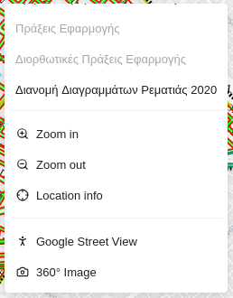
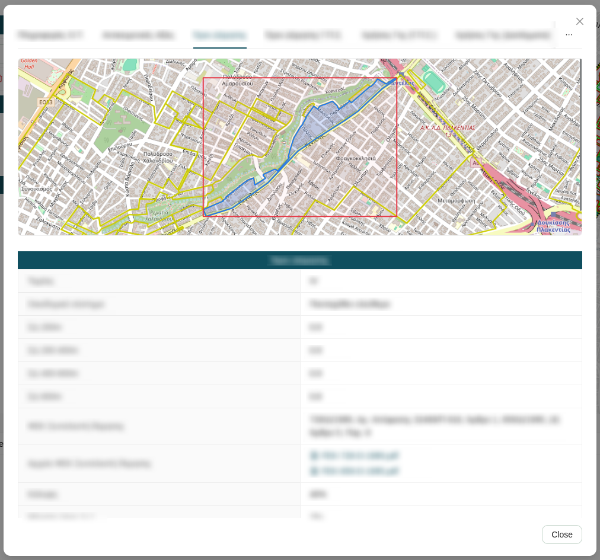
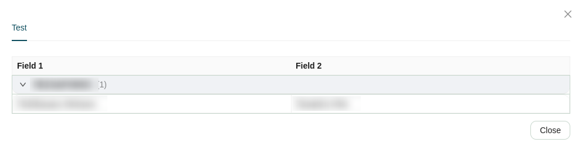

# Right Click

Right-clicking anywhere on the map canvas opens a contextual menu whose available **events** and **actions** depend on the area you click. Options that are not available for the selected location appear grayed out.

## Events

Selecting an event opens a modal window whose contents are configured by the administrators of the application. Each event modal presents its information using one of two visualization types: **List** or **Collapse**.

### List

The **List** visualization displays a map at the top of the modal, followed by sections of information below it. Each section acts as a category that groups related attributes together. Within a category, the attribute name is shown on the left and its formatted value on the right.

### Collapse

The **Collapse** visualization displays a map at the top of the modal, followed by a collapsible table below it. The table rows are grouped by an attribute configured by the administrators — for example, grouped by district, category, or status.

Each group appears as a collapsed row showing the grouping value. Click a group to expand it and reveal the rest of the attributes for the features within that group. Click again to collapse it.

## Actions

In addition to the configured events, the contextual menu provides a set of standard map actions:

| Icon | Action | Description |
| :---: | :--- | :--- |
|  | **Zoom in** | Zooms the map canvas in by one level, centered on the clicked location. |
|  | **Zoom out** | Zooms the map canvas out by one level, centered on the clicked location. |
|  | **Location info** | Queries all active map layers at the clicked location and displays the attribute details in the [Feature Info](attribute-table.md#feature-info) tab of the Attribute Table. |
|  | **Google Street View** | Opens Google Street View for the clicked location in a popup window. |
|  | **360° Images** | Opens the panoramic viewer for a 360° street-level image at the clicked location (see [Show 360° Image Coverage](toolbar.md#show-360-image-coverage)). |

