# Sidebar

Located on the left side of the Map Viewer, the collapsible sidebar provides access to the following features:

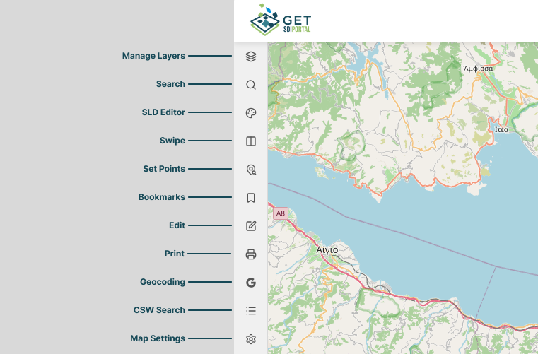

## Manage Layers

The **Manage Layers** panel displays all available map layers within a hierarchical tree structure, allowing you to manage and customize your map view:

* **Organize Layers:** Reorder layers or group them in and out of folders using simple drag-and-drop.
* **Remove Layers:** Delete unnecessary layers by clicking the trashcan icon next to the layer name.
* **Add Custom Data:** Bring in external data sources for visualization by clicking the **Add Data / Manage Layers** button at the top right of the panel.

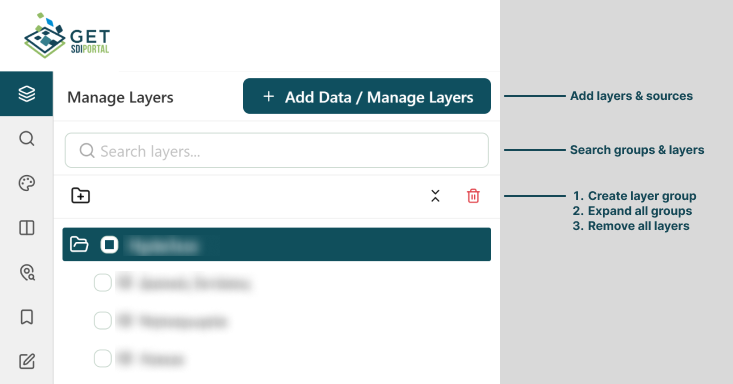

### Expanded layer

Clicking any layer in the layer tree expands its detail view, allowing you to inspect layer properties such as its source name and adjust settings like opacity.

Additionally, the expanded view provides tools to review content and configure layer behavior:

* **Legend & Metadata:** View the layer's legend key and read a brief description of its dataset.
* **Layer Settings:** Toggle layer behaviors, such as making it **Searchable**, **Queryable**, **Editable**, or rendered as a **Single Tile**.
* **Layer Style (SLD):** Select and apply available styling presets (Styled Layer Descriptor) to customize the visual appearance of the layer.

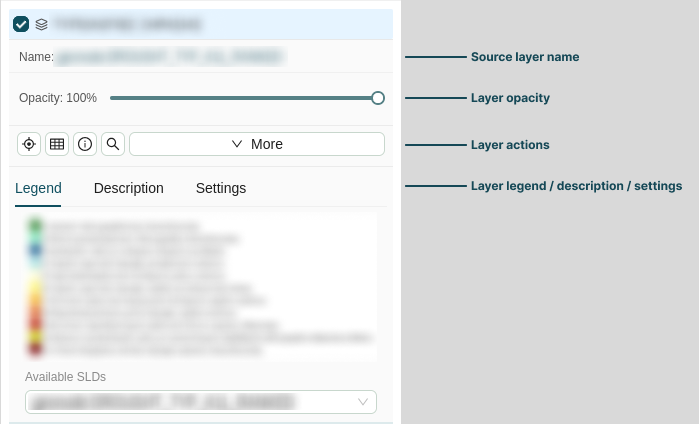

You can manage the layer using the contextual action menu, accessible by **right-clicking** the layer, clicking the three-dots icon (`⋮`) on its right side, or directly from the expanded view:

| Icon | Action | Description |
| :---: | :--- | :--- |
|  | **Zoom to extent** | Zooms and pans the map view to encompass the full geographic area of the selected layer. |
|  | **Data table** | Opens the [Datatable Results](attribute-table.md#datatable-results) tab in the Attribute Table, showing the underlying tabular data and attributes for all features in the layer. |
|  | **Layer info** | Displays detailed metadata, including layer descriptions, coordinate systems, and source links. |
|  | **Search features** | Query and filter specific features or attributes within the selected layer. |
|  | **Add to swipe** | Adds the selected layer to the Swipe tool for interactive side-by-side comparison with other layers. |
|  | **Download** | Exports the layer's spatial data in supported formats (e.g. GeoJSON, Shapefile, CSV). |
|  | **Hide Layer** | Toggles the visibility of the layer on the main map canvas without deleting it from your layer tree. |
|  | **Rename layer** | Modifies the display name of the layer in your layer tree. |
|  | **Remove layer** | Permanently deletes the layer from your current map session. |

### Adding sources

To add new layers, click the **Add Data / Manage Layers** button at the top right of the panel. This opens a modal divided into three tabs:

* **Available sources:** Displays all connected layer sources and their respective types. Remove a source by clicking the **✕** icon next to it.

    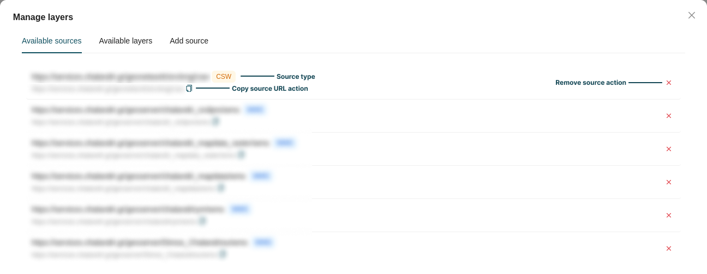

* **Available layers:** Displays all accessible layers, categorized and searchable by their source. Use the checkbox next to a layer's name to enable or disable it, or click the **✕** icon to remove it entirely.

    

* **Add source:** Connect new external data sources and import custom layers. Each source type requires specific configuration.

    

The following formats and protocols are supported:

| Source | Type | Added via |
| :--- | :--- | :--- |
| [WMS](#wms) | OGC service | Server URL |
| [WFS](#wfs) | OGC service | Server URL |
| [WMTS](#wmts) | OGC service | Server URL |
| [CSW](#csw) | OGC service | Catalog URL |
| [STAC Item](#stac-item) | Catalog | Item URL |
| [STAC Browser](#stac-browser) | Catalog | Catalog URL + TiTiler URL |
| [Shapefile](#shapefile) | File upload | `.zip` archive |
| [KML](#kml) | File upload | `.kml` / `.kmz` |
| [GeoJSON](#geojson) | File upload | `.geojson` / `.json` |
| [DXF](#dxf) | File upload | `.dxf` |
| [GPX](#gpx) | File upload | `.gpx` / `.trk` / `.rte` |

#### WMS

[Web Map Service (WMS)](https://www.ogc.org/standard/wms/) is an OGC standard that serves georeferenced map images over the internet, ideal for visualizing geographic data as a static picture.

To add a WMS source, insert your server URL (typically ending in `/wms`) and click **Register**. This connects the source, allowing you to select and load its available layers into your map.

#### WFS

[Web Feature Service (WFS)](https://www.ogc.org/standard/wfs/) is an OGC standard for requesting and editing raw vector geographic features, allowing you to interact with the underlying data directly.

To add a WFS source, insert your server URL (typically ending in `/wfs`) and click **Register**. This connects the source, allowing you to select and load its available vector layers.

#### WMTS

[Web Map Tile Service (WMTS)](https://www.ogc.org/standard/wmts/) is an OGC standard that serves pre-rendered or cached map tiles, ensuring highly optimized performance and fast load times.

To add a WMTS source, insert your server URL (typically ending in `/wmts`) and click **Register**. This connects the source, allowing you to select and load its available tile layers.

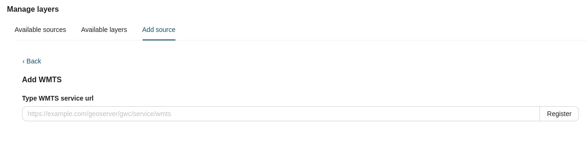

#### Shapefile

A [Shapefile](https://www.esri.com/content/dam/esrisites/sitecore-archive/Files/Pdfs/library/whitepapers/pdfs/shapefile.pdf) is a widely supported Esri vector data format used for storing geometric locations and attribute information.

To add a Shapefile source, upload a `.zip` archive containing the required mandatory files (such as `.shp`, `.dbf`, and `.prj`). Once processed, you can select which of the contained layers to display.

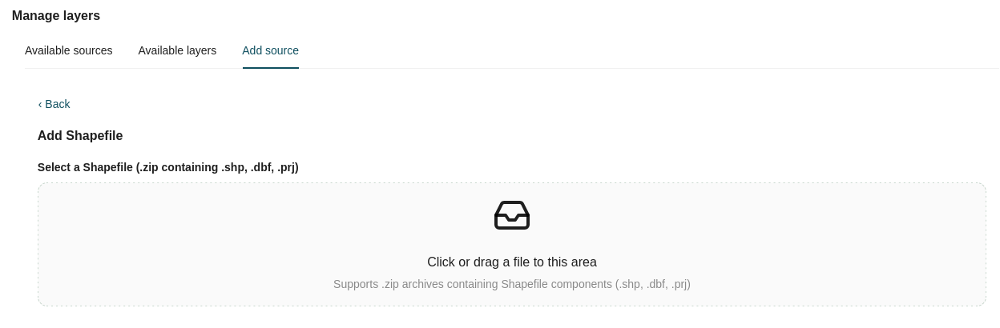

#### KML

[Keyhole Markup Language (KML)](https://www.ogc.org/standard/kml/) is an XML-based format used to display geographic annotations and data in Earth browsers like Google Earth.

To add a KML source, upload a valid `.kml` or `.kmz` file. The file's contents will automatically load as a map layer.

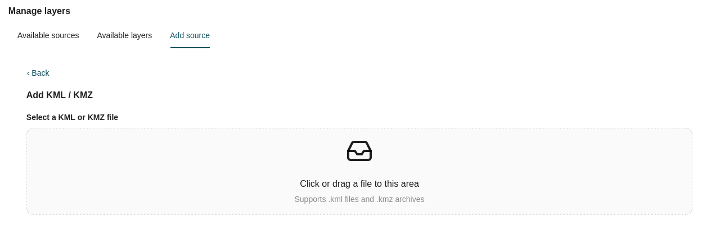

#### GeoJSON

[GeoJSON](https://geojson.org/) is an open standard format designed for representing simple geographical features, along with their non-spatial attributes, using JSON.

To add a GeoJSON source, upload a valid `.geojson` or `.json` file to load it as a layer. The Coordinate Reference System (CRS) is automatically detected from the file.

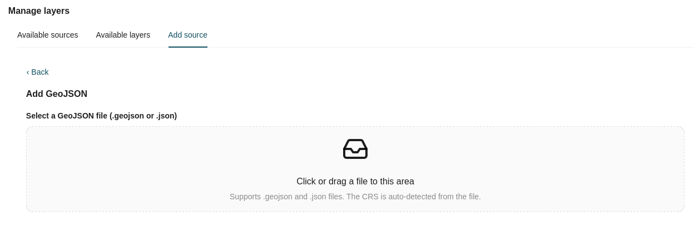

#### DXF

[Drawing Exchange Format (DXF)](https://en.wikipedia.org/wiki/AutoCAD_DXF) is a CAD data file format developed by Autodesk to enable data interoperability between AutoCAD and other programs.

To add a DXF source, upload a valid `.dxf` file.

!!! info "Supported AutoCAD entities"

    `LINE`, `LWPOLYLINE`, `POLYLINE`, `CIRCLE`, `ARC`, `SPLINE`, and `POINT`.

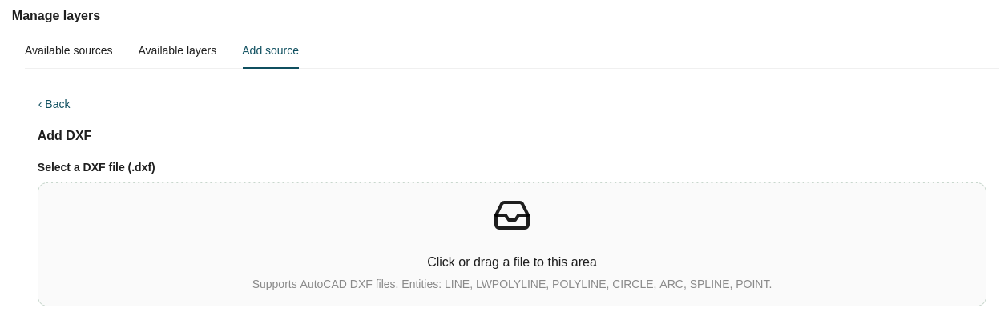

#### GPX

[GPS Exchange Format (GPX)](https://www.topografix.com/gpx.asp) is an XML schema designed as a common GPS data format for describing waypoints, tracks, and routes.

To add a GPX source, upload a valid `.gpx`, `.trk`, or `.rte` file.

!!! note

    The CRS for GPX files is always assumed to be WGS 84 (`EPSG:4326`).

#### CSW

[Catalog Service for the Web (CSW)](https://www.ogc.org/standard/cat/) is an OGC standard used to expose and search metadata records for geospatial data, services, and related resources.

To add a CSW source, insert your catalog URL (typically ending in `/csw`) and click **Register**. This connects the source, allowing you to search and select available metadata layers to add.

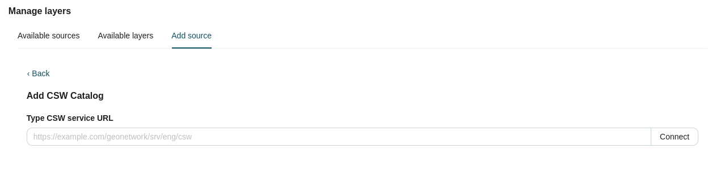

#### STAC Item

A [SpatioTemporal Asset Catalog (STAC)](https://stacspec.org/) Item is a standardized JSON format that represents a specific distinct entity in space and time, such as a satellite image.

To add a STAC Item source, insert the item URL (typically ending in `/item-id.json`) and click **Register**. This connects the source, allowing you to select and add its available assets as layers.

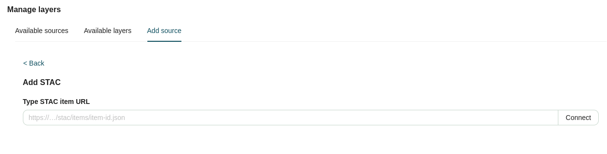

#### STAC Browser

The STAC Browser allows you to navigate and visualize entire [STAC Catalogs](https://stacspec.org/) directly within the map viewer.

To add a STAC Browser source, provide both the STAC Catalog URL (typically ending in `/stac`) and an accompanying TiTiler tile server URL (typically ending in `/titiler`). Once registered, you can dynamically browse the catalog contents and selectively add STAC items to your map.

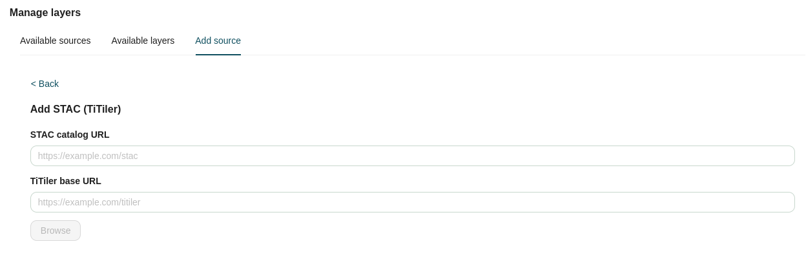

STAC catalog data is hierarchically organized into **Collections**, which contain multiple distinct **Items**. You can navigate this structure to locate specific datasets.

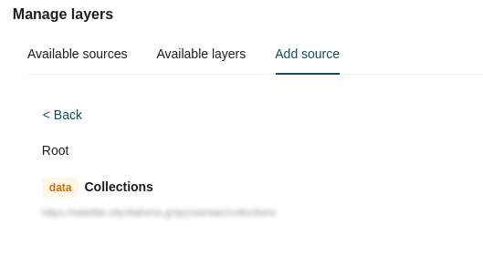

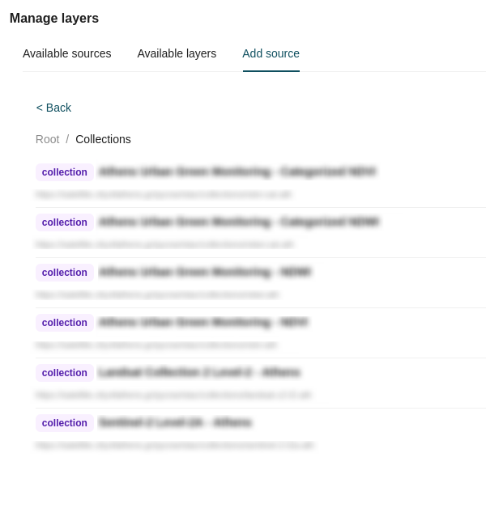

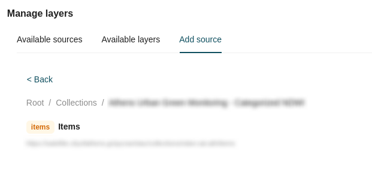

Within a collection, you can refine the visible items using the available filtering tools:

* **Temporal Filter:** Filter items by defining a start and end date using the two **date picker** inputs.
* **Spatial Filter:** Restrict the results to your current geographic view by checking the **Map extent** checkbox.

Each item in the list displays its name and acquisition date. Selecting an item reveals its detailed metadata, including the collection name, description, temporal extent, license, provider, and related tags.

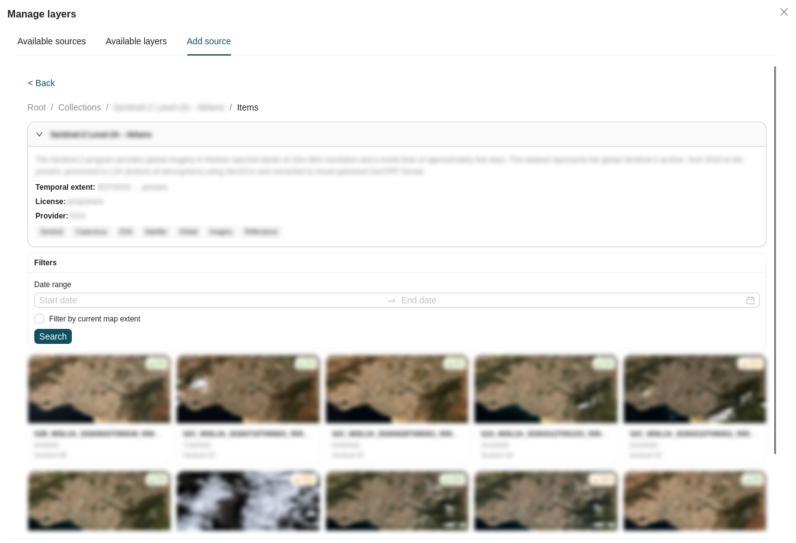

After selecting a specific item, you can configure how its underlying assets are rendered before loading them into the map viewer:

* **Asset Selection:** Choose specific assets (e.g. spectral bands) from the item's available list.
* **Math Expressions** *(optional)*: Apply band math expressions to generate custom visualizations - for example, `(B08-B04)/(B08+B04)` for an NDVI index. Enabling this automatically sets the `asset_as_band=true` parameter.
* **Rescale:** Define custom **Min** and **Max** values to adjust the contrast and rendering scale of the asset.
* **Colormap:** Select a predefined color palette to apply to single-band assets or derived expressions.

Once your rendering parameters are configured, apply the changes to add the customized STAC asset directly to your map view as a new layer.

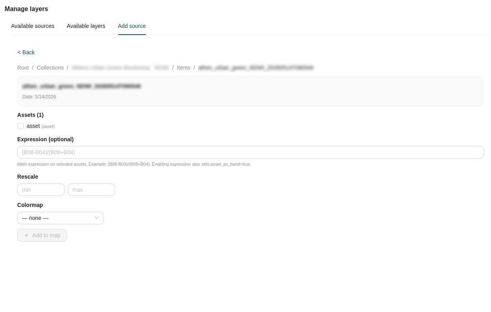

## Search

The **Search** panel lets you find features in a single map layer by combining **attribute conditions** (field values) and **spatial conditions** (an area of interest). Matching features are shown in a results table while the layer is filtered on the map.

At the top of the panel is a **Select Layer** dropdown. Selecting a layer creates a group with the following options:

* Add spatial criteria.
* Add attribute criteria.
* Group join selector (AND/OR).

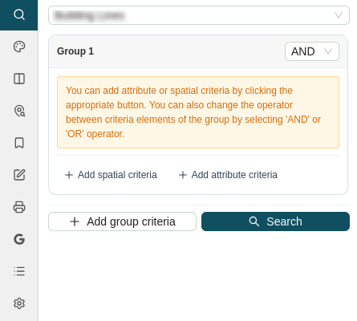

### Add Spatial Criteria

Spatial criteria let you perform a search based on a geometric area of interest.

#### Geometry Selection Dropdown

This dropdown selects where the search geometry comes from.

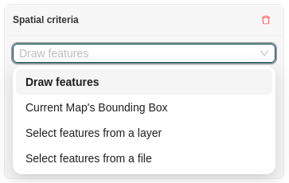

##### Draw Features

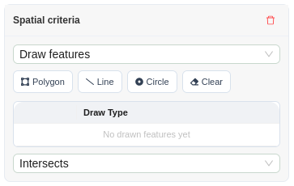

Draw Features lets you draw the area of interest directly on the map using three shape tools:

* Polygon
* Line
* Circle

Click **Clear** to remove all shapes drawn to the map.

Below the shape buttons is a list of the shapes that have been drawn to the map. From this list you can delete a shape, locate its position, and choose the **relation** check to perform against it, based on its position on the map:

| Relation | Matches features that… |
| :--- | :--- |
| **Intersects** | Touch or overlap the drawn shape in any way. |
| **Within** | Lie completely inside the drawn shape. |
| **Crosses** | Pass through the drawn shape (typical for lines against polygons). |

##### Current Map's Bounding Box

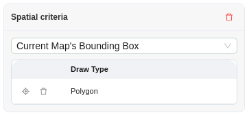

Captures the map's current extent as a rectangle the moment you choose this option.

!!! note

    The relation is automatically set to **Within**, and the rectangle cannot be deleted from the table.

##### Select features from a layer

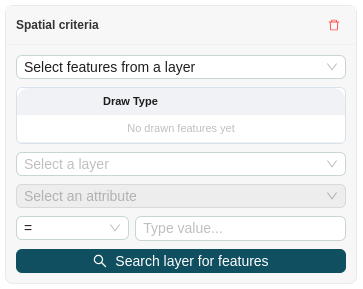

Uses geometries from another layer as the area of interest:

1. Choose the source layer.
2. Choose an attribute of that layer, an **operator**, and a **value** to filter its features. If the attribute is left blank, the condition applies to all features of the layer.
3. Click **Search layer for features**.

The matching geometries are fetched (over WFS for served layers, or read directly from memory for locally loaded files) and appear in the shapes table, where they behave like drawn shapes.

##### Select features from a file

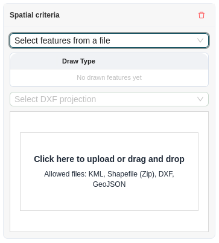

Uploads geometries from a file. Drag a file onto the drop zone or click it to browse.

**Accepted formats:** KML, Shapefile (zipped `.zip`), DXF, GeoJSON (`.geojson` / `.json`).

Projection handling:

| Format | CRS handling |
| :--- | :--- |
| **GeoJSON** | Uses the CRS declared in the file; if none is present, `EPSG:4326` is used by default. |
| **Shapefile (ZIP)** | `EPSG:4326` is assumed. |
| **KML** | Read in its standard projection. |
| **DXF** | Carries no CRS - you must pick the file's projection from the **Select DXF projection** dropdown (`EPSG:2100`, `EPSG:4326`, `EPSG:3857`) before uploading. |

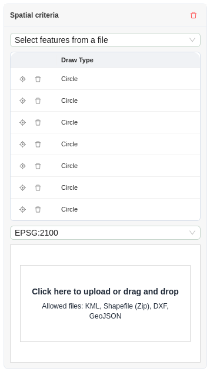

### Add Attribute Criteria

An attribute criterion is made up of three parts:

| Part | Description |
| :--- | :--- |
| **Attribute** | Select one of the layer's fields. |
| **Operator** | `=`, `≠`, `<`, `≤`, `>`, `≥`, `LIKE`, `IS NULL`, or `IS NOT NULL`. |
| **Value** | Free text. Disabled (`No value required`) for `IS NULL` / `IS NOT NULL`. |

* Purely numeric input is compared as a number; anything else is compared as text.
* `LIKE` accepts SQL wildcards - `%` for any run of characters, `_` for a single character. For example, `Kalli%` matches `Kallithea` and `Kallipoli`.
* Single quotes in your value are escaped for you.
* A criterion with no attribute selected, or with an empty value where one is required, is ignored.

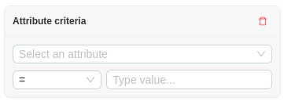

### Group join selector (AND/OR)

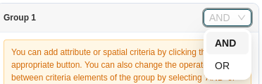

Each group has an **AND / OR** selector in its header. The operator on `Group 1` affects the criteria within `Group 1`.

Groups can be deleted with the bin icon in their header (the last remaining group cannot be deleted). Empty groups are simply skipped when the search runs.

## SLD Editor

The **SLD Editor** panel allows you to create and apply custom [Styled Layer Descriptor (SLD)](https://www.ogc.org/standard/sld/) styles to WMS layers, giving you fine-grained control over how a layer's features are symbolized and labeled on the map canvas.

To begin, select a **WMS layer** from the dropdown and enter a **Style name** to identify the new style you are creating.

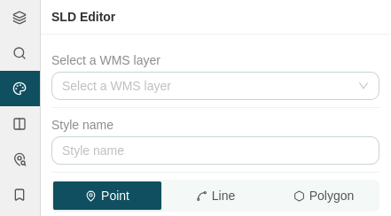

The editor is organized into three tabs, each corresponding to a geometry type: **Point**, **Line**, and **Polygon**. Within each tab you can build one or more style rules that define the appearance of the layer's features. Multiple rules are displayed as their own tabs, allowing you to configure distinct symbology for different subsets of the data.

### Point Rules

The **Point** tab lets you configure how point features are symbolized:

* **Rule title:** Enter a descriptive name for the rule.
* **Symbol:** Select the point marker shape from the dropdown: *Circle*, *Square*, *Triangle*, *Star*, *Cross*, or *X*.
* **Fill Color:** Choose the marker's fill color using the color picker.
* **Size:** Set the marker size using the number input.
* **Stroke Color:** Choose the marker's outline color using the color picker.
* **Stroke Size:** Set the outline thickness using the number input.

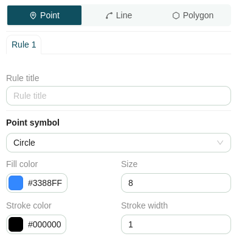

#### Label

Expand the **Label** section to configure feature labels for the rule:

* **Enable labels:** Check this box to turn on labeling. The following options become available once enabled:
    * **Label attribute:** Select the attribute field whose values will be displayed as the label.
    * **Font Family:** Choose the typeface: *Arial*, *Times New Roman*, *Courier New*, *Georgia*, *Verdana*, or *Tahoma*.
    * **Font Size:** Set the label text size.
    * **Font Color:** Choose the label color using the color picker.
    * **Bold:** Check to render labels in bold.
    * **Italic:** Check to render labels in italic.

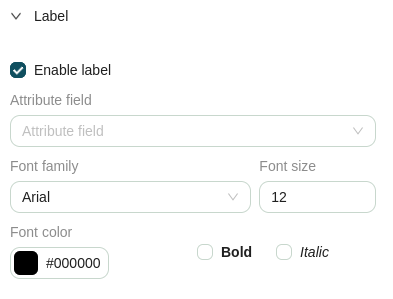

#### Attribute Filters

Expand the **Attribute Filters** section to restrict the rule to features matching specific conditions. Click **Add filter** to add a new criterion; each criterion is made up of three parts:

| Part | Description |
| :--- | :--- |
| **Attribute** | Dropdown to select the layer field. |
| **Operator** | `=`, `≠`, `<`, `≤`, `>`, `≥`, or `LIKE`. |
| **Value** | Free text value to compare against. |

You can add multiple filter criteria to a single rule, and remove any criterion by clicking the trashcan icon next to it.

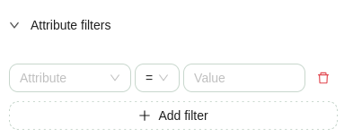

### Line Rules

The **Line** tab lets you configure how line features are symbolized:

* **Rule title:** Enter a descriptive name for the rule.
* **Stroke Color:** Choose the line color using the color picker.
* **Stroke Width:** Set the line thickness using the number input.

Line rules share the same **Label** and **Attribute Filters** sections described under [Point Rules](#point-rules).

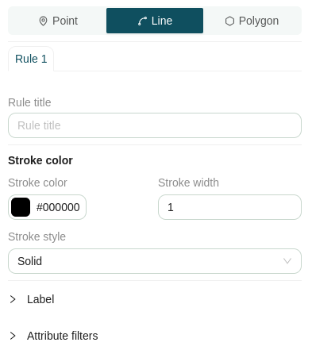

### Polygon Rules

The **Polygon** tab lets you configure how polygon features are symbolized:

* **Rule title:** Enter a descriptive name for the rule.
* **Fill Color:** Choose the fill color using the color picker.
* **Fill Opacity:** Adjust the transparency of the fill using the slider.
* **Stroke Color:** Choose the outline color using the color picker.
* **Stroke Width:** Set the outline thickness using the number input.
* **Stroke Style:** Select the outline pattern: *Solid*, *Dashed*, *Dotted*, or *Dash-dot*.

Polygon rules share the same **Label** and **Attribute Filters** sections described under [Point Rules](#point-rules).

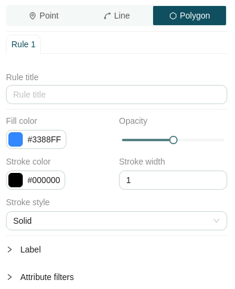

### Saving a Style

Once your rules are configured, use the actions at the bottom of the panel:

* **Save:** Saves the SLD style without applying it.
* **Save and apply:** Saves the SLD style and immediately applies it to the layer in the map viewer.

## Swipe

The **Swipe** panel allows you to perform interactive, side-by-side visual comparisons between multiple map layers using a dynamic split-screen overlay.

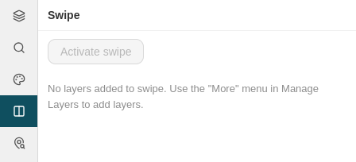

### Adding Layers to Swipe

To compare layers, you must first send them to the Swipe tool from the [**Manage Layers**](#manage-layers) panel:

1. Open the contextual menu (`⋮` or right-click) for any active layer.
2. Select **Add to swipe**.

Once added, a swipe indicator icon () will appear next to the layer name in the Manage Layers tree to confirm it is queued for comparison.

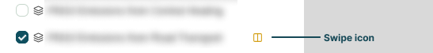

### Configuring and Activating Swipe

From the Swipe panel, you can customize how layers are compared across the map canvas:

* **Position Controls:** Assign each layer to display on the **Left**, **Right**, or **Both** sides of the comparison line.
* **Remove Layers:** Unqueue a layer from the swipe view by clicking the trashcan icon next to its name.

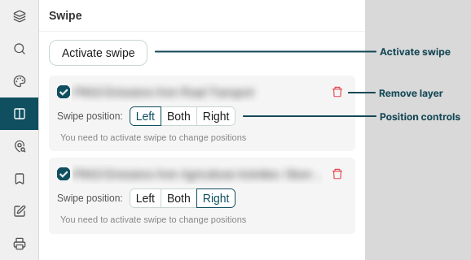

To initiate the visual tool, click the **Activate Swipe** button at the top of the panel. A draggable vertical slider will appear across the map canvas, allowing you to reveal or conceal layers in real time as you move it left and right.

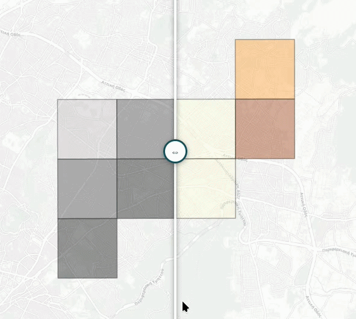

## Set Points

The **Set Points** panel allows you to plot precise coordinate locations directly onto the map canvas using supported spatial reference systems, label them for identification, and inspect underlying layer attributes at those locations.

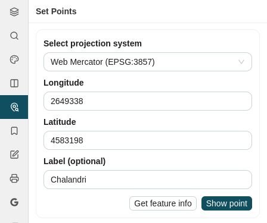

### Adding Points

To add a point to the map, configure the following fields in the form:

* **Projection:** Select the Coordinate Reference System (CRS) for your input coordinates from the dropdown menu:

    | Projection / CRS | EPSG Code | Unit | Description |
    | :--- | :---: | :---: | :--- |
    | **WGS 84** | `EPSG:4326` | Degrees | World Geodetic System; standard geographic coordinates (Longitude, Latitude). |
    | **Web Mercator** | `EPSG:3857` | Meters | Projected coordinate system used by web mapping services (OpenStreetMap, Google Maps). |
    | **GGRS87 / ΕΓΣΑ 87** | `EPSG:2100` | Meters | Greek Geodetic Reference System 1987; standard projected system for Greece. |

* **Longitude / X:** Enter the X coordinate value or geographic longitude.
* **Latitude / Y:** Enter the Y coordinate value or geographic latitude.
* **Label** *(optional)*: Enter a custom name or identifier to describe the point location.

After setting the parameters, click **Show point** to add the coordinate marker to the map and populate it in the points list below.

### Managing and Querying Points

All plotted points are maintained in a list within the panel, where you can interact with them using the following controls:

* **Inspect Feature Info:** Click **Get Feature Info** (available within both the input form and the individual point items) to query all active map layers at that precise coordinate. The resulting attribute details display in the [Feature Info](attribute-table.md#feature-info) tab of the Attribute Table.
* **Pan to Point:** Click **Pan to point** at the bottom right of any listed item to re-center the map viewer on that specific location.
* **Remove Point:** Click the trashcan icon in the top-right corner of a point card to delete the marker from the map and list.

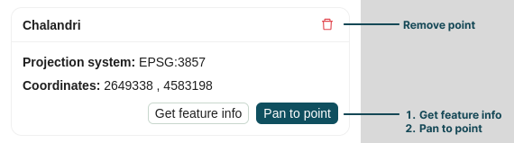

Once created, the points are immediately rendered on the main map canvas with visual markers:

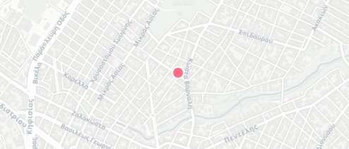

## Bookmarks

The **Bookmarks** panel allows you to save and manage specific geographic locations and zoom levels (map extents) so you can quickly return to areas of interest during your session.

### Creating a Bookmark

To bookmark your current view:

1. Pan and zoom the map canvas to the desired geographic area.
2. Enter a descriptive name in the **Label** field.
3. Click **Save current map view**.

Your saved view will instantly appear in the bookmarks list below.

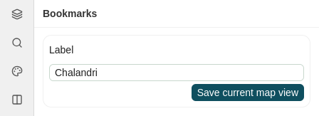

### Managing Bookmarks

Saved bookmarks are displayed as cards within the panel, offering quick-action controls for navigation:

| Icon | Action | Description |
| :---: | :--- | :--- |
|  | **Zoom to extent** | Instantly pans and zooms the map viewer to the saved geographic extent. |
|  | **Remove bookmark** | Deletes the bookmark from your saved list. |

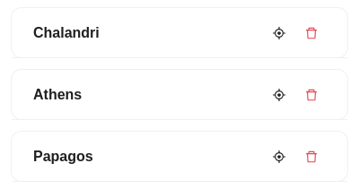

!!! note "Note on Layer Visibility"

    Bookmarks preserve only the map's **geographic extent** (bounding box and zoom level). They do not record or restore layer visibility, active styles, or dataset configurations enabled at the time of creation.

## Edit

The **Edit** panel provides interactive tools for creating, updating, or deleting spatial features and their associated attributes directly within active map layers.

### Access Requirements

Editing capabilities are restricted based on user permissions and layer configurations:

* **User Authentication:** You must be logged into an authorized user account to access editing tools.
* **Layer Eligibility:** Features can only be edited on layers served from trusted GeoServer instances that have been explicitly flagged as **Editable** in their [Layer Settings](#expanded-layer).

!!! info "Advanced Editing Workflows"

    For detailed instructions on editing geometries, modifying feature attribute tables, and saving transactional updates back to the GIS server, refer to the [Map Editor](#map-editor) documentation.

## Print

The **Print** panel allows you to generate high-quality, printable map outputs and PDF exports by defining page layouts, target scales, orientations, and custom cartographic metadata.

### Configuring Print Settings

To prepare your map layout, configure the printing parameters in the form:

* **Page Layout:** Select your target paper dimensions and orientation:

    | Option | Available Choices | Description |
    | :--- | :--- | :--- |
    | **Page Size** | `A4`, `A3`, `A2`, `A1`, `A0` | Controls output dimensions from standard desktop printing (`A4`) to large-format plotters (`A0`). |
    | **Orientation** | `Portrait`, `Landscape` | Sets page alignment relative to your map area of interest. |

* **Map Scale:** Select a fixed map ratio to ensure scale accuracy on physical prints:

    | Scale Category | Available Ratios | Best Used For |
    | :--- | :--- | :--- |
    | **Large Scale** *(High Detail)* | `1:100` – `1:2,000` | Site plans, property boundaries, and detailed engineering layouts. |
    | **Medium Scale** | `1:2,500` – `1:25,000` | Urban planning, neighborhood overview maps, and municipal surveys. |
    | **Small Scale** *(Broad Coverage)* | `1:50,000` – `1:1,000,000` | Regional overviews, country-level datasets, and administrative maps. |

* **Title & Description:** Enter a custom **Title** and optional **Comments** to display on the printed map header and legend block.

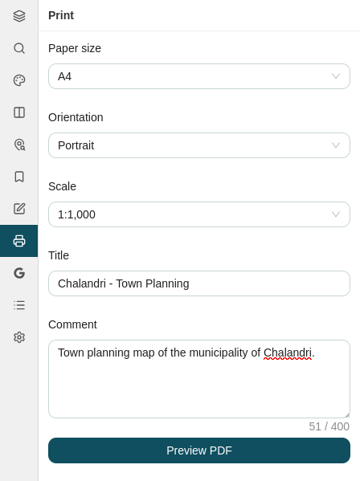

### Adjusting the Print Extent

Once your parameters are configured, generate the interactive extent box:

1. Click **Preview PDF**.
2. A semi-transparent, draggable bounding box reflecting your chosen paper size, orientation, and scale will overlay the map canvas.
3. Click and drag the box across the map viewer to precisely position the area you wish to export.

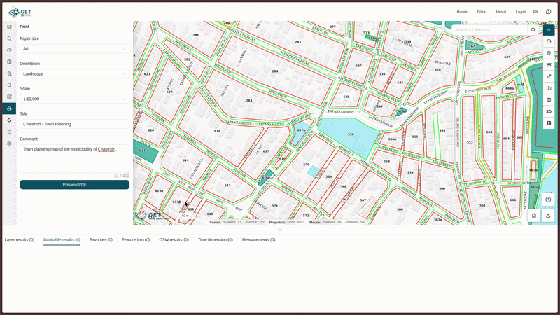

### Exporting and Printing

1. Click **Confirm and print** to generate the document preview.
2. A modal window opens, displaying the finalized print preview layout exactly as it will appear on paper.
3. Use the built-in viewer tools to finalize your document:
    * Click **Save PDF** to download the generated file to your local device.
    * Use the PDF viewer action controls in the top-right corner to send the document directly to a connected printer.

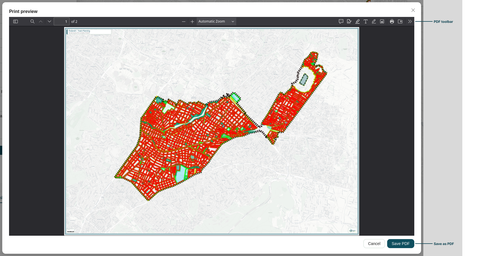

## Geocoding

The **Geocoding** panel enables location lookup by converting coordinates on the map into human-readable addresses (**Reverse Geocoding**), or converting address text into precise map locations (**Geocoding**).

### Geocoding (Address to Point)

The **Geocoding** tab allows you to search for physical addresses or place names:

1. Enter an address or place name into the search bar.
2. Select the matching result from the suggestions list.

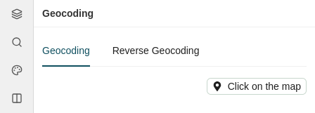

### Reverse Geocoding (Point to Address)

The **Reverse Geocoding** tab allows you to inspect geographical coordinates directly on the map canvas to retrieve address and location details:

1. Click **Click on the map** to activate the selection tool.
2. Click any location directly on the map canvas.

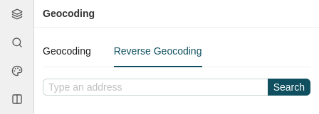

### Point Actions

Result locations generated from either tab create point cards within the panel, giving you interactive controls identical to those in the [Set Points](#managing-and-querying-points) panel:

* **Get Feature Info:** Queries all active map layers at that precise location and displays the attribute details in the [Feature Info](attribute-table.md#feature-info) tab of the Attribute Table.
* **Show point:** Pans and re-centers the map viewer directly onto the selected coordinate.
* **Remove Point:** Click the trashcan icon () in the top-right corner of the card to delete the point marker from the map and list.

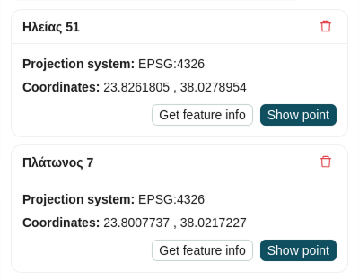

## CSW Search

The **CSW Search** panel allows you to discover, filter, and inspect geospatial metadata records from connected Catalog Service for the Web (CSW) endpoints. The panel is divided into two tabs: **Search Criteria** and **CSW Services**.

### CSW Services

The **CSW Services** tab displays all registered CSW catalog endpoints available for querying:

* **Manage Sources:** Review a tabular list showing each catalog's **Name** and **URL**.
* **Target Queries:** Use the checkmark toggle next to each row to enable or disable specific catalog services from your search scope.

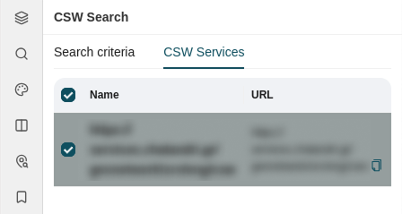

### Search Criteria

The **Search Criteria** tab provides structured filter options across several parameter groups.

#### What (Keyword & Descriptive Filters)

Filter catalog records by descriptive text and target layer constraints:

* **Text Inputs:** Search across specific metadata fields using the **Title**, **Abstract**, **Identifier**, or **Keyword** fields.
* **Target Layer:** Select a layer from the dropdown to restrict the search to layers configured with search or query capabilities in their [Layer Settings](#expanded-layer).

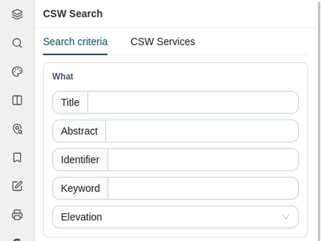

#### Where (Spatial Bounds)

Define the geographic boundary for your search query:

* **Everywhere:** Searches for matching records globally without spatial restrictions.
* **Current map extent:** Limits the search area to the geographic bounding box currently visible on the map canvas.
* **Drawn extent:** Allows you to draw a custom bounding box directly on the map to define your target search area.

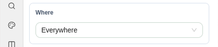

#### When (Temporal Criteria)

Filter records based on dynamic date ranges:

1. Specify date bounds using the **From** and **To** date pickers (`DD/MM/YYYY`).
2. Select the temporal filter type from the **Select criteria** dropdown: **Creation date**, **Publication date**, or **Revision date**.

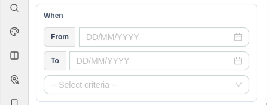

#### Source Type

Filter query results by the structural level and classification of the metadata resource using the **Source type** dropdown:

* **All:** Returns metadata records across all resource classifications without filtering by type.
* **Dataset:** Restricts results to individual geospatial data collections (e.g. a specific vector layer, raster image, or feature class).
* **Service:** Restricts results to web services that serve geospatial functionality or data (e.g. WMS, WFS, WCS, or CSW endpoints).
* **Series:** Restricts results to parent collections or aggregated metadata records composed of multiple related datasets grouped under a single umbrella.

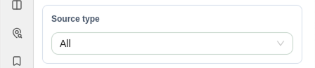

#### Advanced Criteria

Expand the **Advanced Criteria** section to apply fine-grained metadata and quality filters:

* **Organizational Roles:** Enter a **Responsible party** and select their role from the **Select responsible party role** dropdown (*Resource provider*, *Custodian*, *Owner*, *User*, *Distributor*, *Originator*, *Point of contact*, *Principal investigator*, *Processor*, *Publisher*, or *Author*).
* **Constraints & Lineage:** Specify constraints using **Access and use terms**, **Public constraint**, and **Origin**.
* **Quality & Resolution:** Define spatial resolution standards using **Denominator**, **Distance value**, and **Distance UoM** (Unit of Measure), alongside **Specification compliance**.
* **Degree of Conformity:** Choose the compliance evaluation level from the **Degree** dropdown (*Conformant*, *Not conformant*, or *Not evaluated*).

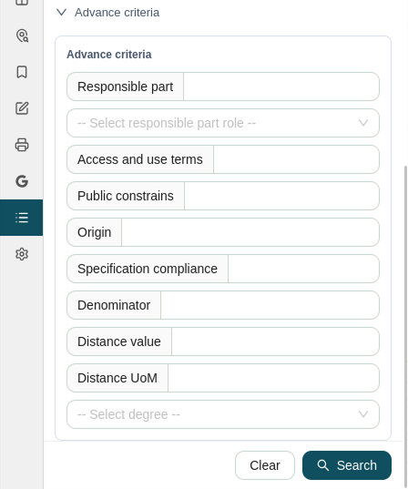

### Running and Resetting Queries

Once your criteria are configured, use the actions at the bottom right of the panel:

* **Clear:** Resets all input fields and returns filters to their default states.
* **Search:** Executes the query across all selected CSW services and displays matching metadata records.

## Map Settings

The **Map Settings** panel allows you to configure basic display units, scale bar presentation, and the underlying map projection for your viewer session.

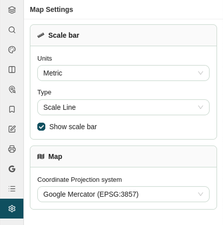

### Scale Bar Options

Customize how distance measurements are displayed on the map canvas:

* **Show scale bar:** Check or uncheck this box to toggle the scale bar overlay on or off.
* **Scale Unit:** Select the unit of measurement from the dropdown (*Metric*, *Nautical Mile*, *US Inch*, *Imperial Inch*, or *Degrees*).
* **Scale Type:** Choose the visual style of the scale indicator (*Scale line* or *Scale bar*).

### Projection System

Change the active Coordinate Reference System (CRS) for the entire map viewer using the **Projection** dropdown:

| Projection | EPSG Code | Description |
| :--- | :--- | :--- |
| **Google Mercator** | `EPSG:3857` | Standard projected coordinate system used by web mapping services. |
| **WGS 84** | `EPSG:4326` | World Geodetic System unprojected geographic coordinates (Longitude, Latitude). |
| **ΕΓΣΑ 87** | `EPSG:2100` | Greek Geodetic Reference System 1987 projected system. |

