# Toolbar

Located on the top right side of the Map Viewer, the toolbar offers a collection of map interaction tools to the user:

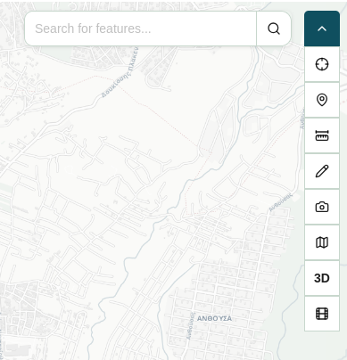

The tools offered are the following:

| Icon | Action |
| :---: | :--- |
|  | **[Quick Search](#quick-search)** |
|  | **[Feature Info](#feature-info)** |
|  | **[Set Point](#set-point)** |
|  | **[Measure distance, area and angle](#measure-distance-area-and-angle)** |
|  | **[Draw points and shapes](#draw-points-and-shapes)** |
|  | **[Map screenshot](#map-screenshot)** |
|  | **[Switch basemap](#switch-basemap)** |
| 3D / 2D  | **[Switch to 3D](#switch-between-3d-and-2d)** |
|  | **[Show 360 image coverage](#show-360-image-coverage)** |

## Quick Search

The **Quick Search** tool provides rapid access to the search functionality described in the [Search](sidebar.md#search) sidebar panel. It allows you to locate features across all active layers that have been flagged as **Searchable** in their [Layer Settings](sidebar.md#expanded-layer).

1. Click the **Quick Search** icon in the toolbar to open the search input field.
2. Enter a keyword or attribute value into the text bar.
3. A tab with the search results opens in the [Layer Results](attribute-table.md#layer-results) tab of the Attribute Table and the map is filtered to display only the searched features.

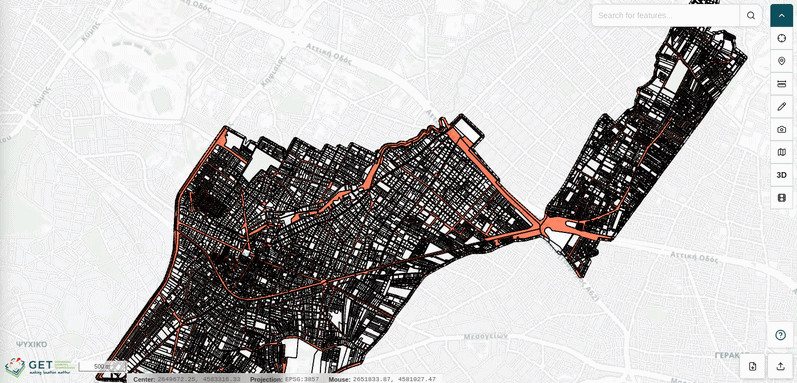

!!! note

    To dismiss the search results, simply close the results tab in the [Layer Results](attribute-table.md#layer-results) tab of the Attribute Table.

## Feature Info

The **Feature Info** tool allows you to interactively query visible map features and retrieve their underlying attribute data directly from the map canvas.

1. Click the **Feature Info** icon in the toolbar to activate the tool. The cursor changes to a crosshair to indicate the tool is active.
2. Click on any visible feature on the map canvas.
3. The attribute details for the selected feature are displayed in the [Feature Info](attribute-table.md#feature-info) tab of the Attribute Table.

## Set Point

The **Set Point** tool provides quick access to the coordinate plotting functionality available in the [Set Points](sidebar.md#set-points) sidebar panel, allowing you to place markers directly on the map canvas with a single click.

1. Click the **Set Point** icon in the toolbar to activate the placement cursor.
2. Click any location on the map canvas to drop a coordinate marker at that position.
3. The point is automatically added to the [Set Points](sidebar.md#set-points) sidebar panel, where you can assign a label, query feature info, pan to its location, or remove it.

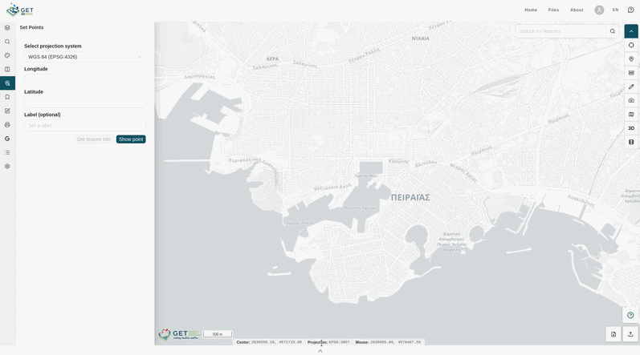

## Measure Distance, Area and Angle

The **Measure** tool allows you to perform on-map measurements of distances, surface areas, and circular regions using interactive drawing controls.

Click the **Measure** icon in the toolbar to expand a secondary toolbar displaying the available measurement modes:

| Icon | Action |
| :---: | :--- |
|  | **[Distance](#distance)** |
|  | **[Area](#area)** |
|  | **[Circle](#circle)** |
|  | **[Angle](#angle)** |
|  | **[Azimuth](#azimuth)** |
|  | **[Clear measurement](#clear-measurement)** |
| ft / m / km / mi / nm  | **[Units](#units)** |

### Distance

The **Distance** mode lets you measure linear distances along a segmented path on the map canvas.

1. Click a starting point on the map to begin the measurement.
2. Click additional points to create individual segments. Each segment's length is displayed alongside it.
3. Double-click to end the measurement and display the total cumulative distance.

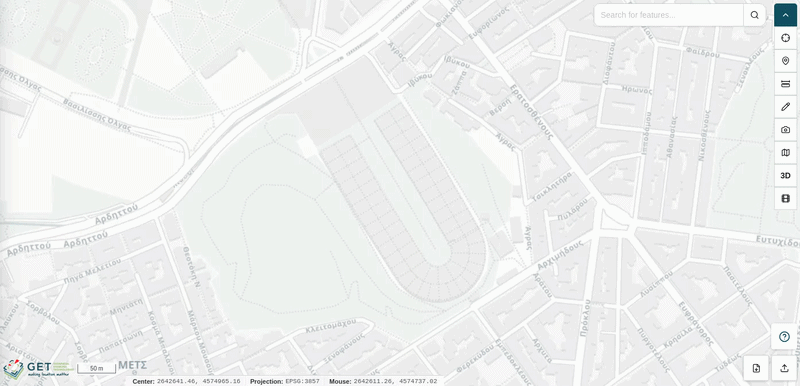

### Area

The **Area** mode lets you measure the surface area of a polygon defined by segmented lines on the map canvas.

1. Click successive points on the map to define the polygon's vertices. Each segment's length is displayed alongside it.
2. Double-click to close the polygon and display the total enclosed area.

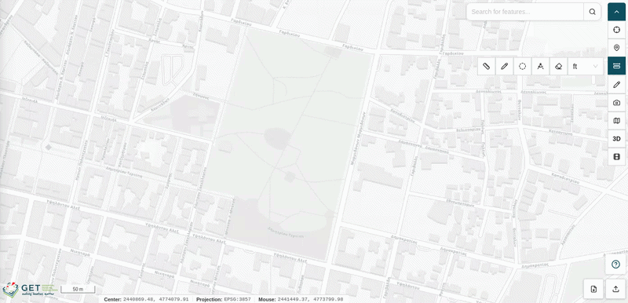

### Circle

The **Circle** mode lets you measure the area of a circular region on the map canvas.

1. Click on the map to define the center of the circle.
2. Drag the cursor outward to adjust the circle's radius in real time.
3. Click to finalize the measurement and display the enclosed area.

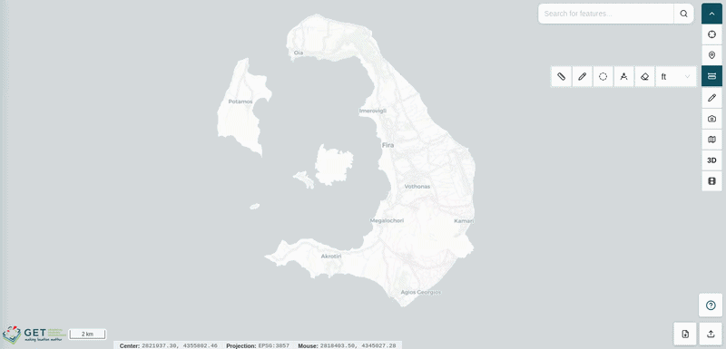

### Angle

The **Angle** mode lets you measure the angle between conescutive segments on the map canvas.

1. Click a starting point on the map to begin the measurement.
2. Click additional points to create individual segments. The inner angle between segments is displayed between segments.
3. Double-click to end the measurement.

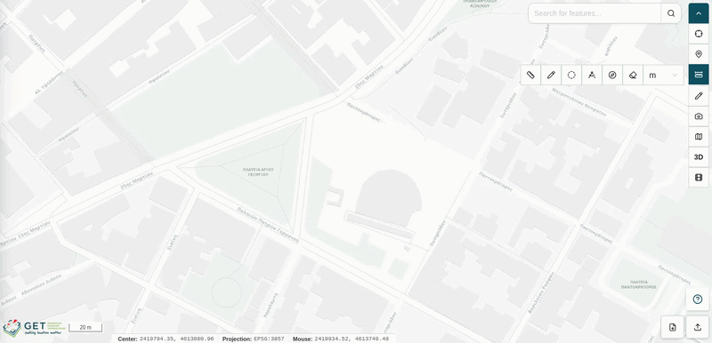

### Azimuth

THe **Azimuth** mode lets you measure the azimuth of a segment.

1. Click a starting point on the map to begin the measurement.
2. Click additional points to create individual segments. The azimuth of the last drawn segment is displayed alongside it.
3. Double-click to end the measurement and display the azimuth of the last drawn segmetn.

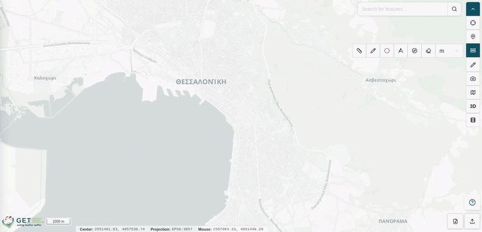

### Clear Measurement

Click the **Clear measurement** button to remove all active measurements from the map canvas.

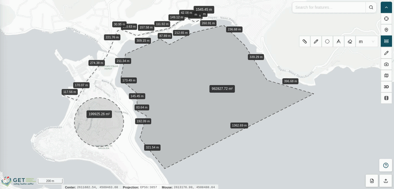

### Units

Select the desired unit of measurement from the **Units** dropdown to change the display unit applied to all active measurements:

| Unit | Abbreviation |
| :--- | :---: |
| **Feet** | `ft` |
| **Meters** | `m` |
| **Kilometers** | `km` |
| **Miles** | `mi` |
| **Nautical Miles** | `nm` |

## Draw Points and Shapes

The **Draw** tool allows you to sketch custom geometries and annotations directly onto the map canvas for visual reference and markup purposes.

Click the **Draw** icon in the toolbar to expand a secondary toolbar displaying the available drawing modes:

| Icon | Action |
| :---: | :--- |
|  | **[Point](#point)** |
|  | **[Line](#line)** |
|  | **[Polygon](#polygon)** |
|  | **[Circle](#circle-1)** |
|  | **[Square](#square)** |
|  | **[Label](#label)** |
|  | **[Clear drawings](#clear-drawings)** |

### Point

The **Point** mode lets you place individual point markers on the map canvas.

1. Click the **Point** icon to activate the placement cursor.
2. Click any location on the map to place a point marker.

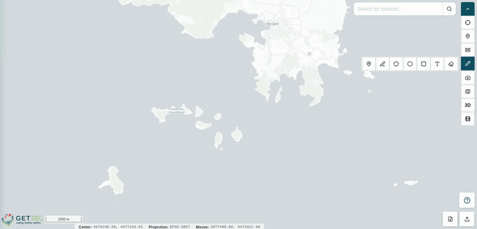

!!! note

    Points created with the Draw tool are visual annotations only. They do not carry attribute data, cannot be queried with Feature Info, and do not appear in the [Set Points](sidebar.md#set-points) sidebar panel.

### Line

The **Line** mode lets you draw freeform line geometries on the map canvas.

1. Click a starting point on the map to begin the line.
2. Click additional points to create individual segments.
3. Double-click to end the line.

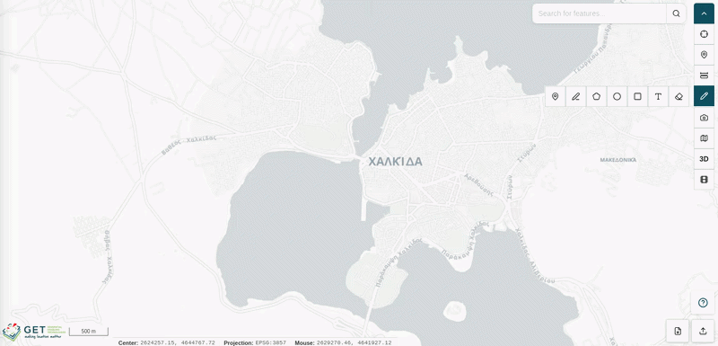

### Polygon

The **Polygon** mode lets you draw closed polygon shapes on the map canvas.

1. Click successive points on the map to define the polygon's vertices.
2. Double-click to close the polygon and complete the shape.

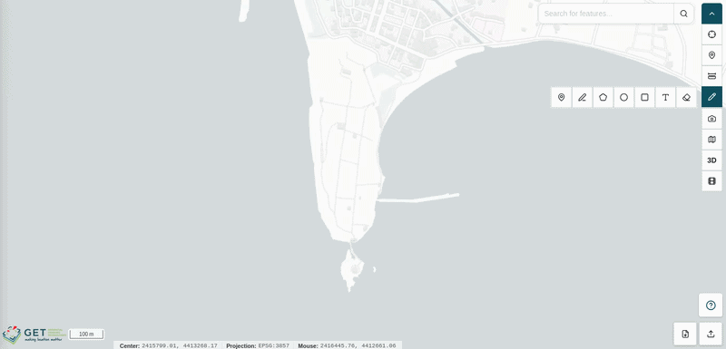

### Circle

The **Circle** mode lets you draw circular shapes on the map canvas.

1. Click on the map to define the center of the circle.
2. Drag the cursor outward to adjust the circle's radius in real time.
3. Click to finalize the shape.

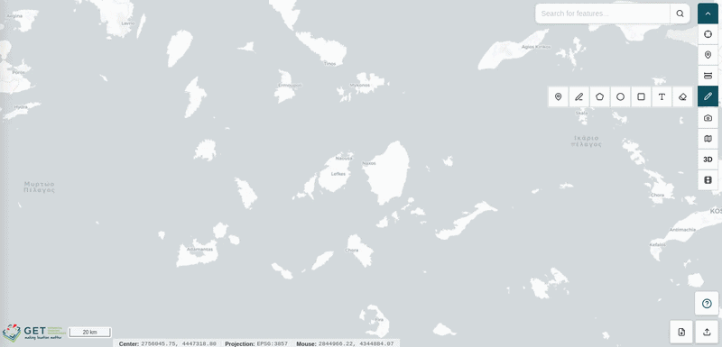

### Square

The **Square** mode lets you draw rectangular shapes on the map canvas.

1. Click on the map to set one corner of the rectangle.
2. Click again to set the opposite corner and complete the shape.

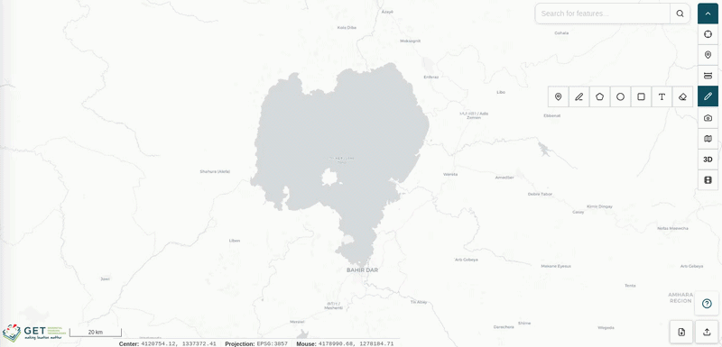

### Label

The **Label** mode lets you place text annotations directly on the map canvas.

1. Click on the map at the desired location.
2. Enter your label text in the input that appears.

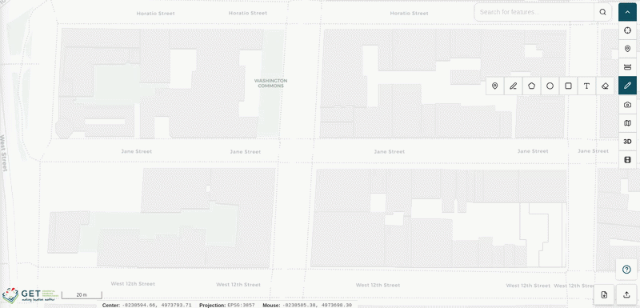

### Clear Drawings

Click the **Clear drawings** button to remove all drawn geometries and annotations from the map canvas.

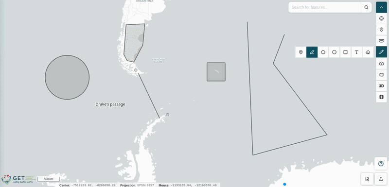

## Map Screenshot

The **Map Screenshot** tool captures an image of the current map canvas, including all visible layers, basemap, and overlays, and saves it directly to your local file system.

1. Click the **Map Screenshot** icon in the toolbar.
2. The application captures the current map view and automatically downloads the image file to your device.

## Switch Basemap

The **Switch Basemap** tool allows you to change the underlying basemap tileset displayed beneath your active layers.

1. Click the **Switch Basemap** icon in the toolbar to open the basemap selection list.
2. Click on any available basemap option to apply it to the map canvas.

The selected basemap is immediately rendered beneath all active layers.

## Switch Between 3D and 2D

The **3D / 2D** toggle switches the map viewer between a flat two-dimensional map view and a three-dimensional globe visualization.

1. Click the **3D / 2D** icon in the toolbar to switch to the alternate view mode.
2. Click again to return to the previous view.

## Show 360° Image Coverage

The **Show 360° Image Coverage** tool displays the locations of all available 360° street-level images as markers on the map canvas, allowing you to visually browse panoramic imagery across the mapped area.

1. Click the **Show 360° Image Coverage** icon in the toolbar to reveal the 360° image location markers on the map.
2. Right-click on any marker to open the contextual menu (see [Right Click](right-click.md#right-click) for more details).
3. Select **360° Image** from the menu to open the panoramic viewer in a popup window.

From within the panoramic viewer, you can navigate between adjacent 360° images using the directional arrows, or click the **Play** button to automatically advance through a sequence of images along the available path.

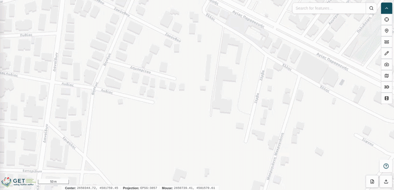

