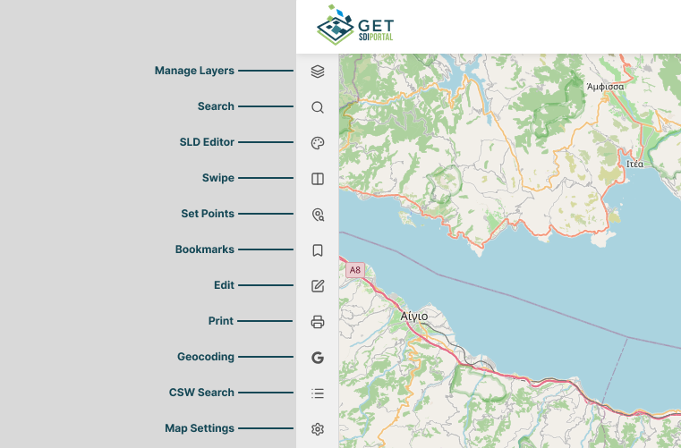
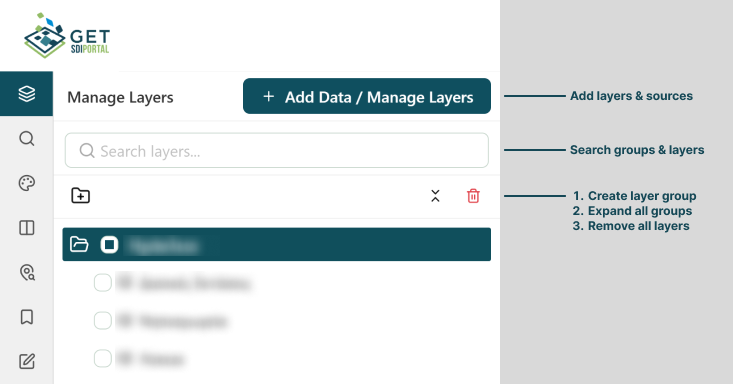

# Map Viewer

The **Map Viewer** can be accessed by clicking any publicly available map on the home page. As a core application feature, it provides essential tools for interacting with and managing spatial data.

## Sidebar

Located on the left side of the Map Viewer, the collapsible sidebar provides access to the following features:

### Manage Layers

The Manage Layers panel displays all available map layers within a hierarchical tree structure, allowing you to manage and customize your map view:

* **Organize Layers:** Reorder layers or group them in and out of folders using simple drag-and-drop functionality.
* **Remove Layers:** Delete unnecessary layers by clicking the trashcan icon next to the layer name.
* **Add Custom Data:** Bring in external data sources for visualization by clicking the **Add Data / Manage Layers** button at the top right of the panel.

#### Expanded layer view

Clicking any layer in the layer tree expands its detail view, allowing you to inspect layer properties such as its source name and adjust settings like opacity.

Additionally, the expanded view provides tools to review content and configure layer behavior:

* **Legend & Metadata:** View the layer's legend key and read a brief description of its dataset.
* **Layer Settings:** Toggle layer behaviors, such as making it **Searchable**, **Queryable**, **Editable**, or rendered as a **Single Tile**.
* **Layer Style (SLD):** Select and apply available styling presets (Styled Layer Descriptor) to customize the visual appearance of the layer.

You can manage the layer using the contextual action menu, accessible by **right-clicking** the layer, clicking the three dots icon (`⋮`) on its right side, or directly from the expanded view:

| Icon | Action | Description |
| :---: | :--- | :--- |
|  | **Zoom to extent** | Zooms and pans the map view to encompass the full geographic area of the selected layer. |
|  | **Data table** | Opens an attribute table showing the underlying tabular data and attributes for all features in the layer. |
|  | **Layer info** | Displays detailed metadata, including layer descriptions, coordinate systems, and source links. |
|  | **Search features** | Allows you to query and filter specific features or attributes within the selected layer. |
|  | **Add to swipe** | Adds the selected layer to the Swipe tool for interactive side-by-side comparison with other layers. |
|  | **Download** | Exports the layer's spatial data in supported formats (e.g., GeoJSON, Shapefile, CSV). |
|  | **Hide Layer** | Toggles the visibility of the layer on the main map canvas without deleting it from your layer tree. |
|  | **Rename layer** | Modifies the display name of the layer in your layer tree. |
|  | **Remove layer** | Permanently deletes the layer from your current map session. |

#### Adding sources

### Search
### SLD Editor
### Swipe
### Set Points
### Bookmarks
### Edit
### Geocoding
### CSW Search
### Map Settings

## Toolbar